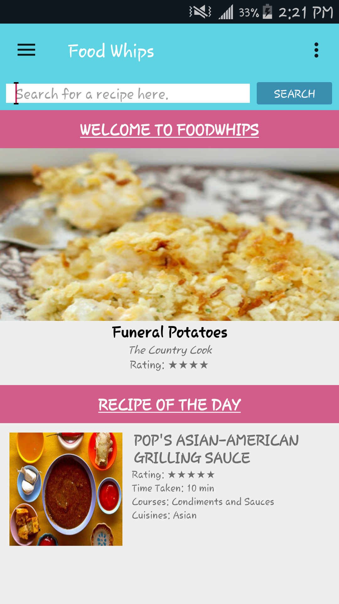
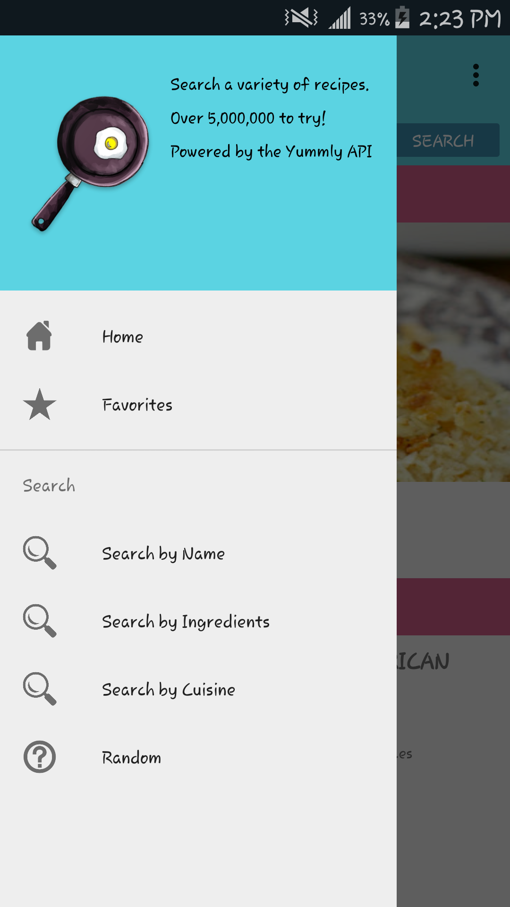
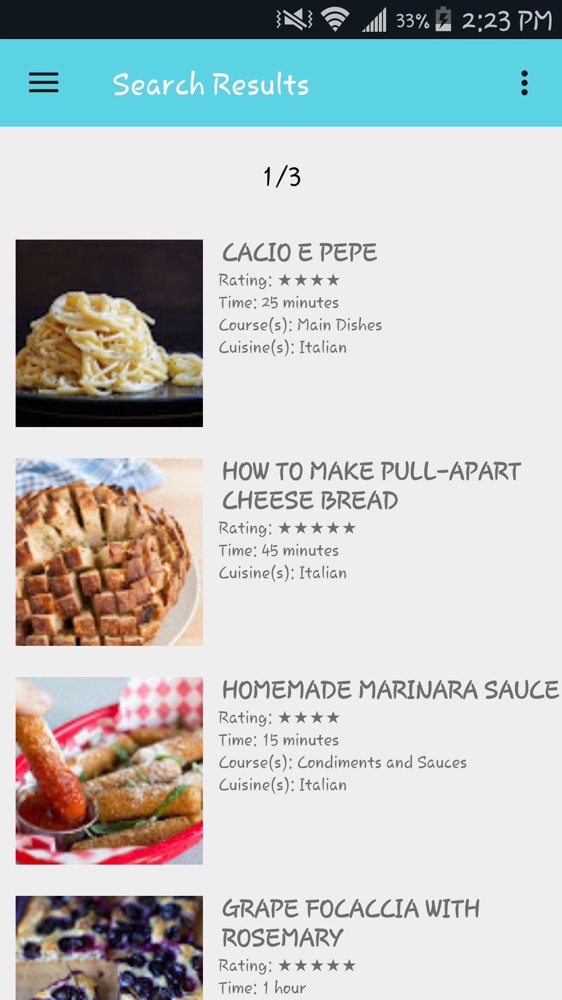
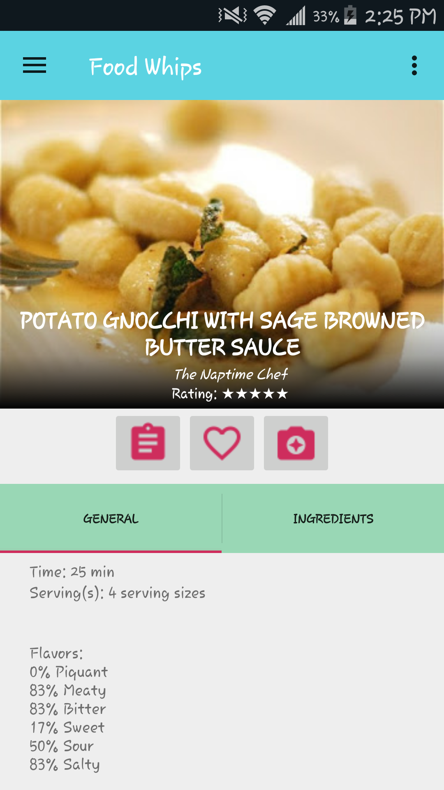
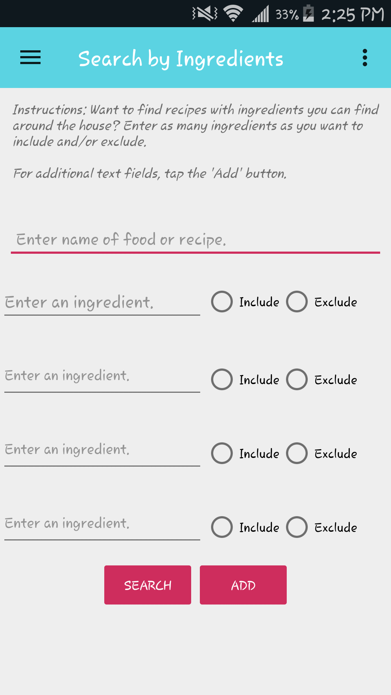
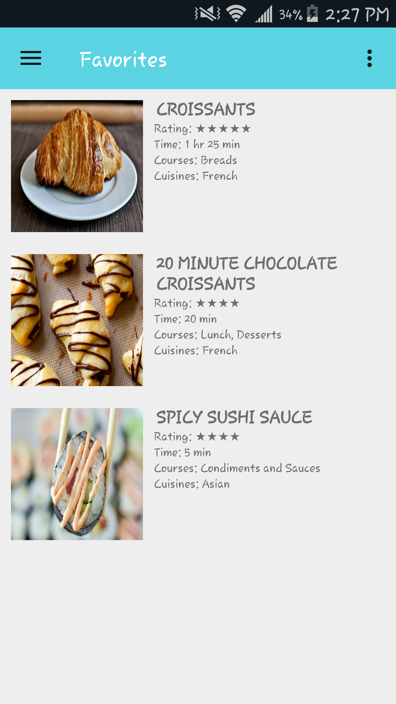

# Food Whips Android App
```
Developed by Ariel Suarez, Leanne David, and Vincent Luu
For: CalStateLA CS 4540 - Android Class (Summer 2017)
```


### Draft


### Final
  
  


## Idea
Often times, we as students (and others too!) don't know what to eat or cook at home. We are tired of the same old food and want to try something a little bit different. One way was to make use of the ingredients lying around the house, but we don't know exactly what to do or make with them. Thus, the idea of Food Whips was born.

## Basis
The purpose of the android application is to provide the user easy access to a variety of recipes based on their own criteria. This includes features such as searching for recipes base by ingredients (inclusion and exclusion), holidays, diets, and more.


## Features
- Base navigation drawer for easy traversing to multiple parts of the application
- Store recipes into a local database to save them for future purposes
- Camera and Photo feature to allow the user to attach a photo of their version of the recipe
- Various filter options (Search by Name, Search by Ingredients, Search by Cuisine)
- Random recipe option for the indecisive


## Functions
### For Navigation Drawer

#### Favorites Activity:
- Gives a list of all recipes the user has favorited
- If the user updates (i.e. tapping and un-favoriting a recipe), this list reflects the changes accordingly

#### Search by Name Activity:
- Narrows down results of recipes based on max time, diet, holidays, and cuisine
- Time is required but all other options are optional

#### Search by Ingredients Activity:
- Narrows down results of recipes based on ingredients, both inclusion and exclusion
- User can tap on 'Add' button to dynamically create extra text fields
- If user wants to include an ingredient, select the radio button for 'Include', otherwise select 'Exclude'

#### Search by Cuisine Activity
- Narrows down results of recipes based on cuisine
- User can tap on 'Add' button to dynamically create an extra text field
- If user wants to allow a cuisine, select the radio button for 'Allow', otherwise select 'Exclude'

#### Random Recipe Activity
- Returns results of random recipes based on a variety of options


### For Recipe Details
- Displays general information given about the recipe in the General tab and ingredients needed in the Ingredients tab

##### Clipboard/Instructions icon
- Directs the user to the source of the recipe for instructions; browser opens inside the app

##### Heart/Favorites icon
- Changes depending if the recipe is marked as a favorite or not
- Heart will be filled if marked as a favorite, otherwise, it will be a heart outline
- Links with the camera feature

##### Camera icon
- Recipe must be marked as a favorite to access this feature
- If recipe is not marked, user receives a Toast message to favorite the recipe first
- Two options to attach an image: Take a Photo and Choose From Gallery

### For Search Results Activity
- Displays only the first 30 results (if applicable) of any search
- User can swipe to the next page from the header
- If reached the last page, user returns to the first page


## Work Division

###### Ariel:
- Code efficiency and implementation lead
- Working base Navigation Drawer
- About page
- Camera feature and storing them into the local database
- Co-worked with Vincent on his part + page swiper on the search results

###### Leanne:
- Project organization and clean-up
- UI design
- Main page, search results, favorites, and recipe details functions
- Local database setup
- In charge of all the git pulling and merging conflicts from all branches to master

###### Vincent:
- Building appropriate URLs for all the different search filters
- Designing all the filter forms including dynamic text fields
- Co-worked with Ariel on page swiper in the search results
- In charge of powerpoint presentation setup

###### Shared:
- Debugging and fixing errors found


## Credit:
- API - yummly, academic access
- Application Icon - drawn by Leanne David
- Clipboard, Heart, Camera icons - material.io
